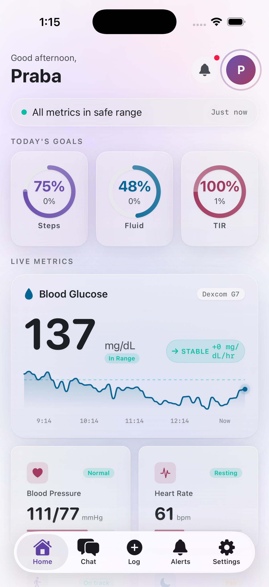
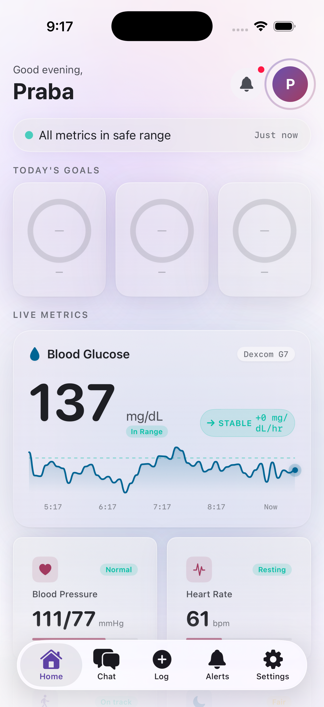
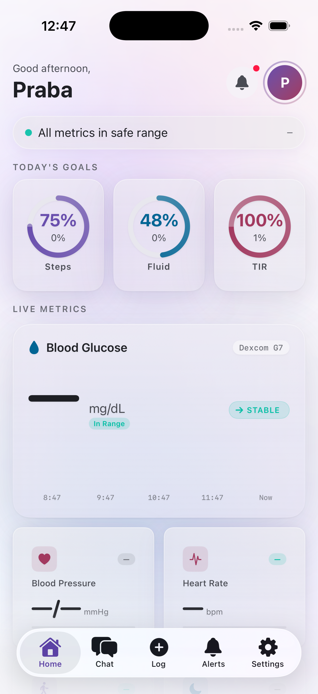

# VitaCore

**Privacy-first on-device AI health intelligence for iOS**

VitaCore is a fully on-device health monitoring and intelligence app that uses Gemma AI to analyse health data, detect patterns, and provide actionable wellness insights — all without sending any personal health information over the network.

---

## Screenshots

| Home Dashboard | Chat AI | Alerts |
|:-:|:-:|:-:|
|  |  |  |

---

## Key Features

- **100% On-Device AI** — Gemma 3n/4 E4B runs locally via MLX-Swift. No cloud LLM calls. Your health data never leaves your phone.
- **Multi-Cofactor Analysis** — Correlates glucose, heart rate, sleep, activity, nutrition, and medications to find root causes of health patterns.
- **Real-Time Monitoring** — HeartbeatEngine checks your vitals every 60 seconds against personalised threshold bands.
- **Fast-Path Alerts** — Glucose < 70 mg/dL or irregular heart rate triggers immediate notifications.
- **Smart Persona Engine** — Auto-classifies your health profile (T1D, T2D, prediabetic, healthy) from your data and sets appropriate thresholds.
- **HealthKit Integration** — Reads from Apple Watch, Dexcom (via HealthKit), Libre, Omron, and manual entries.
- **40+ Polished Screens** — Ethereal Light design system with glass morphism, WCAG AAA accessibility, and iOS 26 Liquid Glass support.

---

## Project Status

| Phase | Status | Completion |
|-------|--------|------------|
| Phase 0: Infrastructure PoCs | Done | 100% |
| Phase 1: Foundation (ThresholdEngine + InferenceProvider) | Done | 100% |
| Phase 2: ETL Pipeline (SkillBus + HealthKit) | Done | 100% |
| Phase 3: Intelligence Core (HeartbeatEngine + MiroFish RCA) | In Progress | 40% |
| Phase 4: Alert Delivery + TestFlight | Pending | 0% |
| **Overall** | **Building** | **~65%** |

**Current version:** `v0.7.0` | **Target:** TestFlight in 6 weeks

---

## Tech Stack

| Layer | Technology |
|-------|-----------|
| Language | Swift 5.9 |
| UI | SwiftUI (iOS 17+, @Observable) |
| AI/LLM | MLX-Swift + Gemma 3n E4B (on-device, 4-bit quantised) |
| Database | GRDB.swift 7.10+ (SQLite) |
| Health Data | Apple HealthKit |
| Build | xcodegen + Swift Package Manager |
| Min Device | iPhone 15 Pro (A17 Pro, 8 GB RAM) |
| Target OS | iOS 17.0+ |

---

## Repository Structure

```
VitaCore/
│
├── VitaCoreApp/                          # FRONTEND — SwiftUI App Target
│   ├── VitaCoreApp.swift                 #   App entry point + dependency injection
│   ├── EnvironmentKeys.swift             #   SwiftUI environment key definitions
│   ├── ContentView.swift                 #   Root view
│   └── Screens/                          #   All UI screens (68 Swift files)
│       ├── Home/                         #     Dashboard, metric cards, goal rings
│       │   ├── HomeDashboardView.swift
│       │   ├── HomeDashboardViewModel.swift
│       │   ├── QuickLogStrip.swift
│       │   └── MonitoringDetailView.swift
│       ├── Chat/                         #     AI conversation interface
│       │   ├── ChatView.swift
│       │   ├── ChatViewModel.swift
│       │   ├── ConversationHistoryView.swift
│       │   ├── ProactiveSessionView.swift
│       │   └── MessageBubble.swift
│       ├── Log/                          #     Manual data entry sheets
│       │   ├── GlucoseEntrySheet.swift
│       │   ├── BPEntrySheet.swift
│       │   ├── FluidEntrySheet.swift
│       │   ├── WeightEntrySheet.swift
│       │   ├── NoteEntrySheet.swift
│       │   └── LogHubView.swift
│       ├── Alerts/                       #     Alert panels (critical/alert/watch)
│       │   ├── CriticalAlertView.swift
│       │   ├── AlertHistoryView.swift
│       │   ├── AlertDetailView.swift
│       │   └── WatchBannerView.swift
│       ├── Settings/                     #     12 settings screens
│       │   ├── SettingsView.swift
│       │   ├── ProfileSettingsView.swift
│       │   ├── ConditionsSettingsView.swift
│       │   ├── MedicationsSettingsView.swift
│       │   ├── GoalsSettingsView.swift
│       │   ├── AllergiesSettingsView.swift
│       │   ├── ConnectionsSettingsView.swift
│       │   ├── ConnectionsSettingsViewModel.swift
│       │   ├── NotificationsSettingsView.swift
│       │   ├── PrivacySettingsView.swift
│       │   ├── BackupRestoreSettingsView.swift
│       │   └── ExportSettingsView.swift
│       ├── Onboarding/                   #     8-step onboarding flow
│       │   ├── OnboardingContainer.swift
│       │   ├── OnboardingWelcomeView.swift
│       │   ├── OnboardingBasicProfileView.swift
│       │   ├── OnboardingConditionsView.swift
│       │   ├── OnboardingMedicationsView.swift
│       │   ├── OnboardingGoalsView.swift
│       │   ├── OnboardingAllergiesView.swift
│       │   ├── OnboardingPermissionsView.swift
│       │   ├── OnboardingDownloadView.swift
│       │   └── OnboardingFlowCoordinator.swift
│       ├── MetricDetail/                 #     Per-metric detail views
│       │   ├── GlucoseDetailView.swift
│       │   ├── HeartRateDetailView.swift
│       │   ├── BloodPressureDetailView.swift
│       │   ├── StepsDetailView.swift
│       │   ├── SleepDetailView.swift
│       │   └── GoalDetailView.swift
│       ├── FoodFlow/                     #     Food logging + camera flow
│       ├── Widgets/                      #     Widget gallery
│       └── Shared/                       #     Reusable view components
│
├── Packages/                             # BACKEND — Swift Package Manager
│   │
│   │  ┌─── CONTRACTS (frozen, do not modify) ───┐
│   ├── VitaCoreContracts/                #  19 files: 5 protocols + 13 model types
│   │   └── Sources/VitaCoreContracts/
│   │       ├── Protocols/                #    GraphStoreProtocol, PersonaEngineProtocol,
│   │       │                             #    InferenceProviderProtocol, SkillBusProtocol,
│   │       │                             #    AlertRouterProtocol
│   │       └── Models/                   #    Reading, Episode, PersonaContext, ThresholdSet,
│   │                                     #    InferenceRequest, PrescriptionCard, etc.
│   │
│   │  ┌─── DESIGN SYSTEM ───┐
│   ├── VitaCoreDesign/                   #  16 files: tokens + glass components
│   │   └── Sources/VitaCoreDesign/
│   │       ├── Tokens/                   #    ColorTokens, TypographyTokens, SpacingTokens,
│   │       │                             #    RadiusTokens, AnimationTokens
│   │       ├── Components/               #    GlassCard, MetricCard, GoalRing, SparklineChart,
│   │       │                             #    StatusBadge, HealthStateBar, BackgroundMesh, etc.
│   │       └── Modifiers/               #    GlassModifier, AnimationModifiers
│   │
│   │  ┌─── CORE BACKEND PACKAGES ───┐
│   ├── VitaCoreGraph/                    #  C02: GRDB/SQLite graph store
│   │   ├── Sources/ (5 files)            #    GRDBGraphStore, Schema, ReadingRow, EpisodeRow
│   │   └── Tests/ (1 file, 8 tests)      #    Round-trip, range, aggregate, snapshot, purge
│   │
│   ├── VitaCorePersona/                  #  C01: PersonaEngine + graph-driven inferencer
│   │   ├── Sources/ (5 files)            #    VitaCorePersonaEngine, GRDBPersonaStore,
│   │   │                                 #    PersonaInferencer, InstallIdentity, Schema
│   │   └── Tests/ (1 file, 11 tests)     #    4-cohort classification, bootstrap, mutations
│   │
│   ├── VitaCoreThreshold/                #  C14: ThresholdEngine + priority stack resolver
│   │   ├── Sources/ (3 files)            #    ThresholdResolver, ConditionProfiles (5),
│   │   │                                 #    MedicationModifiers (3)
│   │   └── Tests/ (1 file, 14 tests)     #    Profiles, priority stack, meds, clinician override
│   │
│   ├── VitaCoreInference/                #  C10: MLX-Swift Gemma runtime + InferenceProvider
│   │   ├── Sources/ (4 files)            #    Gemma4Runtime, VitaCoreInferenceProvider,
│   │   │                                 #    SystemPromptBuilder, ConversationStore
│   │   └── Tests/ (2 files, 20 tests)    #    Runtime smoke, provider fallback, food analysis
│   │
│   ├── VitaCoreSkillBus/                 #  C03: SkillBus + manual entry + HealthKitSkill
│   │   ├── Sources/ (2 files)            #    VitaCoreSkillBus (6 log methods), HealthKitSkill
│   │   └── Tests/ (1 file, 9 tests)      #    All log types, skill management, range query
│   │
│   ├── VitaCoreHeartbeat/                #  C09: Monitoring loop + fast-path alerts
│   │   ├── Sources/ (1 file)             #    HeartbeatEngine (60s cycle, crossing detection)
│   │   └── Tests/ (1 file, 5 tests)      #    Hypo fast-path, HR fast-path, crossing, audit
│   │
│   │  ┌─── INFRASTRUCTURE ───┐
│   ├── VitaCoreSynthetic/                #  Synthetic health data for testing
│   │   ├── Sources/ (6 files)            #    4 personas, 7 generators, EpisodeLabeler,
│   │   │                                 #    CohortBuilder, SeededGenerator (SplitMix64)
│   │   └── Tests/ (1 file, 7 tests)      #    Determinism, ranges, episodes, GRDB round-trip
│   │
│   ├── VitaCoreMock/                     #  Mock implementations for SwiftUI preview
│   │   └── Sources/ (11 files)           #    MockDataProvider + 5 protocol mocks + mock data
│   │
│   └── VitaCoreNavigation/              #  Navigation router + tab management
│       └── Sources/ (4 files)            #    NavigationRouter, TabRouter, SheetPresenter,
│                                         #    AlertPresentationManager
│
├── specs/                                # SPEC KIT — Feature specifications
│   └── 001-vitacore-wave1-foundation/
│       ├── spec.md                       #   30 FRs, 9 SCs, 7 user stories, 10 edge cases
│       ├── plan.md                       #   Architecture, phases, performance budgets
│       └── tasks.md                      #   71 tasks with T### IDs, phase grouping
│
├── screenshots/                          # Milestone screenshots from simulator
│
├── .specify/                             # Spec Kit templates + constitution
│   └── memory/
│       └── constitution.md               #   v1.0.0: 8 principles, 13 locked ADs
│
├── project.yml                           # xcodegen project definition (source of truth)
├── ARCHITECTURE.md                       # System architecture document
├── CONTRIBUTING.md                       # Developer onboarding guide
├── README.md                             # This file
└── .gitignore                            # Dev-team standard ignores
```

---

## Quick Start

### Prerequisites

| Tool | Version | Install |
|------|---------|---------|
| Xcode | 17+ (iOS 26.2 SDK) | Mac App Store |
| xcodegen | Latest | `brew install xcodegen` |
| Metal Toolchain | Xcode 26 component | `xcodebuild -downloadComponent MetalToolchain` |

### Build & Run

```bash
# 1. Clone
git clone https://github.com/gowthamprabakar/Victacore-.git
cd Victacore-

# 2. Generate Xcode project
xcodegen generate

# 3. Open in Xcode
open VitaCore.xcodeproj

# 4. Select "iPhone 17 Pro" simulator → Build & Run (Cmd+R)
```

### Build with Demo Data

Demo mode seeds 14 days of synthetic T1D health data on first launch:

```bash
xcodebuild -project VitaCore.xcodeproj -scheme VitaCore \
  -destination 'platform=iOS Simulator,name=iPhone 17 Pro' \
  SWIFT_ACTIVE_COMPILATION_CONDITIONS='DEBUG DEMO_MODE' build
```

### Run Tests

```bash
# All backend packages
cd Packages/VitaCoreGraph && swift test
cd Packages/VitaCorePersona && swift test
cd Packages/VitaCoreThreshold && swift test
cd Packages/VitaCoreInference && swift test
cd Packages/VitaCoreSkillBus && swift test
cd Packages/VitaCoreHeartbeat && swift test
cd Packages/VitaCoreSynthetic && swift test
```

**Total: ~107 test functions across 8 test files**

---

## Architecture

### Data Flow

```
  Apple Watch / Dexcom / Manual Entry
                │
                ▼
         ┌──────────────┐
         │  SkillBus     │  ← C03: normalises + deduplicates
         │  (6 skills)   │
         └──────┬───────┘
                │ writeReading() / writeEpisode()
                ▼
         ┌──────────────┐
         │  GraphStore   │  ← C02: GRDB/SQLite (vitacore.sqlite)
         │  (readings    │     readings, episodes, nodes, edges
         │   + episodes) │
         └──────┬───────┘
                │
         ┌──────┴───────┐
         │              │
         ▼              ▼
  ┌─────────────┐ ┌──────────────┐
  │ PersonaEngine│ │ HeartbeatEngine│ ← C09: 60s monitoring cycle
  │ (inferencer) │ │ (threshold    │
  │             │ │  crossing)    │
  └──────┬──────┘ └──────┬───────┘
         │              │
         ▼              ▼
  ┌─────────────┐ ┌──────────────┐
  │ Threshold   │ │ Inference    │  ← C10: Gemma 3n E4B on-device
  │ Engine      │ │ Provider     │     system prompt + streaming
  │ (5 profiles │ │ (chat +      │
  │  7 levels)  │ │  Rx cards)   │
  └─────────────┘ └──────────────┘
                        │
                        ▼
                  ┌──────────────┐
                  │ SwiftUI UI   │  ← 40+ screens, glass design system
                  │ (Home, Chat, │
                  │  Log, Alerts,│
                  │  Settings)   │
                  └──────────────┘
```

### 5 Frozen Protocol Contracts

These interfaces are locked and MUST NOT be modified:

| # | Protocol | Methods | Real Implementation |
|---|----------|---------|-------------------|
| 1 | `GraphStoreProtocol` | 10 (read/write/aggregate/snapshot/purge) | `GRDBGraphStore` |
| 2 | `PersonaEngineProtocol` | 10 (CRUD for conditions/goals/meds/allergies) | `VitaCorePersonaEngine` |
| 3 | `InferenceProviderProtocol` | 8 (chat/prescriptions/food/sessions) | `VitaCoreInferenceProvider` |
| 4 | `SkillBusProtocol` | 10 (skill mgmt + 6 log methods) | `VitaCoreSkillBus` |
| 5 | `AlertRouterProtocol` | 4 (history/acknowledge/subscribe) | Mock (HeartbeatEngine handles alerts) |

### 11 Swift Packages

| Package | Role | Source Files | Tests |
|---------|------|:---:|:---:|
| **VitaCoreContracts** | Frozen protocols + model types | 19 | — |
| **VitaCoreDesign** | Ethereal Light design system | 16 | — |
| **VitaCoreGraph** | GRDB/SQLite graph store | 5 | 8 |
| **VitaCorePersona** | PersonaEngine + graph inferencer | 5 | 11 |
| **VitaCoreThreshold** | ThresholdEngine + priority stack | 3 | 14 |
| **VitaCoreInference** | Gemma runtime + InferenceProvider | 4 | 20 |
| **VitaCoreSkillBus** | Manual entry + HealthKit skill | 2 | 9 |
| **VitaCoreHeartbeat** | Monitoring loop + fast-path alerts | 1 | 5 |
| **VitaCoreSynthetic** | 4-persona test data generators | 6 | 7 |
| **VitaCoreMock** | Mock implementations for previews | 11 | — |
| **VitaCoreNavigation** | Routing + tab management | 4 | — |

---

## Synthetic Data Engine

VitaCore includes a built-in synthetic health data generator for testing and demos. Four persona archetypes with physiologically-grounded signal models:

| Persona | Glucose Pattern | Key Features |
|---------|----------------|--------------|
| **T1D on Pump + CGM** | 70-235 mg/dL, dawn phenomenon, meal spikes, exercise dips, sensor noise, hypo events | Dexcom 5-min sampling, 2 fingersticks/day |
| **T2D on Oral Meds** | Flatter curves, post-meal peaks, morning elevation | 3 fingersticks/day, comorbid hypertension |
| **Prediabetic** | Mostly normal with stress-induced excursions | 1 fingerstick/day, lifestyle intervention |
| **Healthy Optimizer** | Tight 92-115 mg/dL band | 1 fingerstick/day, Apple Watch only |

Each persona generates: glucose, heart rate, blood pressure, steps, sleep, food logs, weight, and ground-truth episodes. All deterministic via seeded SplitMix64 RNG.

---

## Version History

| Version | Date | Milestone |
|---------|------|-----------|
| `v0.7.0` | Apr 2026 | Dev-team docs + version control |
| `v0.6.0` | Apr 2026 | C09 HeartbeatEngine — monitoring + fast-path alerts |
| `v0.5.0` | Apr 2026 | C04 HealthKitSkill + UI wiring audit |
| `v0.4.0` | Apr 2026 | C03 SkillBus — 5/5 protocols real |
| `v0.3.0` | Apr 2026 | C10 InferenceProvider — Gemma + conversations |
| `v0.2.0` | Apr 2026 | C14 ThresholdEngine — 5 profiles, priority stack |
| `v0.1.0` | Apr 2026 | Foundation — 35K LOC, 8 packages, 40+ screens |

---

## Branching Strategy

| Branch | Purpose |
|--------|---------|
| `main` | Production-ready tagged releases |
| `develop` | Integration branch — all feature PRs merge here |
| `feature/T###-*` | Individual task branches (one per sprint task) |
| `fix/*` | Bug fixes |
| `release/v*` | Release candidates |

---

## Roadmap to TestFlight

```
Week 1-2:  [DONE] Fix critical bugs + git init
Week 3-4:  [DONE] ThresholdEngine + InferenceProvider
Week 5-7:  [DONE] SkillBus + HealthKit + UI wiring
Week 8-9:  [DONE] HeartbeatEngine monitoring
Week 9-10: [NOW]  MiroFish MVP + multi-cofactor RCA
Week 11:          Chat + Alerts UI wiring
Week 12:          Integration testing + devil-critic review
Week 13:          AlertRouter + notifications
Week 14:          TestFlight submission
```

---

## Architecture Principles

1. **Privacy First** — All inference on-device. No PHI over the network. Ever.
2. **Frozen Contracts** — 5 protocol interfaces locked. Implementations can pivot; contracts cannot.
3. **Component Storage Isolation** — Each package owns its own SQLite file. No cross-DB queries.
4. **Test Against Real Data** — All packages tested against 4-persona synthetic cohorts, not mocks.
5. **Safety Before Completeness** — Tighter thresholds win. Wellness framing only (not medical advice).

Full constitution: `.specify/memory/constitution.md`

---

## For Developers

- **New to the project?** Read `CONTRIBUTING.md` for build setup and code style.
- **Understanding the architecture?** Read `ARCHITECTURE.md` for the full system design.
- **Working on a sprint task?** Check `specs/001-vitacore-wave1-foundation/tasks.md` for task IDs and file references.
- **Running the devil-critic?** Use the `devil-critic` skill in Claude Code to adversarially review any component.

---

## License

Proprietary. All rights reserved.

---

*Built with SwiftUI, GRDB, MLX-Swift, and on-device Gemma AI.*
